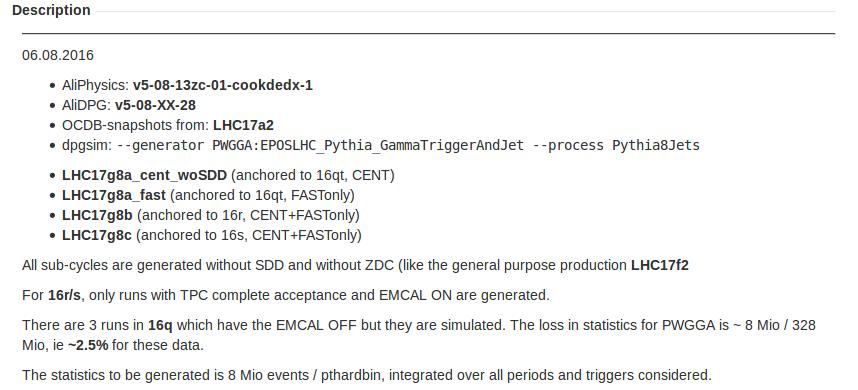

# Integration of Dataset/MC

In the following it will be explained how to get information about the simulation itself and how to obtain the pT hard bin weights that are necessary for your analysis.

## Get information about a new data set

There are several ways to get information about a specific dataset. For Run2 data, several new and well maintained sources are available whereas for Run1 data some information is hard to get. In the following, the main sources of information will be presented: 1. On [MonALISA](https://alimonitor.cern.ch/trains/) select in the sidebar Run Condition Table and select the desired period in the top left \(e.g. choose LHC17p\) and the reconstruction pass \(standard is pass1\) on the top right of the table. The run condition table provides already a lot of important information, like the runnumbers, their corresponding filling schemes and fills, the beam energy and the active detector systems in each run. Another important information is the "Physics Selection Status" which signals the general quality of the run from the detector point of view. The run condition table is a quick and easily accessible source of information. 2. The **Data Preparation Group \(DPG\)** has well maintained information especially for Run2 data. Their main twiki page [AliceDPG](https://twiki.cern.ch/twiki/bin/viewauth/ALICE/AliceDPG) leads to several subpages with useful information. One of these pages is the [DPGDataProcessing](https://twiki.cern.ch/twiki/bin/view/ALICE/DPGDataProcessing2017Progress) page which provides a useful overview of LHC15-LHC17 periods, their collision energies, magnetic field information, interaction rates, reconstruction progress and most important the minimum bias statistics. A similar page, the [AliDPGReconstructedDataTakingPeriodsSummary](https://twiki.cern.ch/twiki/bin/view/ALICE/AliDPGReconstructedDataTakingPeriodsSummary) in addition leads to detailed pages for the individual data sets including the **good run number lists**. 3. The [**Logbook**](https://alice-logbook.cern.ch/logbook) provides additional information about each run. Here, detailed information about **trigger configurations** can be found. This, however, requires advanced knowledge of the used abbreaviations and will, for now, not be further explained.

## Get information about a new simulation

On [MonALISA](https://alimonitor.cern.ch/trains/) select in the sidebar Production info/MC production cycles and scroll to the relevant production. For this example, I will use LHC17g8b.On this page you have several important pieces of information already available. You can see if the simulation is "Completed" or still "Running" or currently in "Quality check 10%".

Furthermore, the corresponding run ranges in data to which the simulation is anchored are shown as well as the total statistics produced.

The most important information can be found in the associated Jira ticket which is given by the ending of the second column. In this case "ALIROOT-7270" which is the ending of the link [https://alice.its.cern.ch/jira/browse/ALIROOT-7270](https://alice.its.cern.ch/jira/browse/ALIROOT-7270).

On this Jira page, the full generation information is available. This covers the AliPhysics version, generator information, run lists, intermediate and final QA as well as further information in the comments section.From the description you can now see that the simulation is anchored to 16r and 8 Mio events per pT hard bin were simulated as this example is a JetJet Monte Carlo simulation.

In order to get further information about the in this case used generator PWGGA:EPOSLHC\_Pythia\_GammaTriggerAndJet one has to refer to the [Data Preparation Group](https://twiki.cern.ch/twiki/bin/viewauth/ALICE/AliceDPG)s Git repository [https://github.com/alisw/AliDPG](https://github.com/alisw/AliDPG).

In this repository, the used generator config can be found in AliDPG/MC/CustomGenerators/PWGGA/EPOSLHC\_Pythia\_GammaTriggerAndJet.C where the setting for the process "Pythia8Jets" are set. The process itself is defined in AliDPG/MC/GeneratorConfig.C where we get infromation about the eta, phi, $$p_{T}^{hard}$$, quenchin and structure function that are used for the simulation.

## Adding the data set or simulation

**In order to add a new data set to the analysis workflow it is always recommended to download a few ESD/AOD files and run local tests with your desired analysis task.** This ensures that corrections/calibrations are loaded correctly and the following changes are implemented without compilation errors:

1. For calorimeter analyses, the AliCaloPhotonCuts::FindEnumForMCSet enum can already be defined as it will later on be necessary for the cluster energy calibration \(Non-linearity correction\).
2. The AliConvEventCuts::SetPeriodEnum\(\) should be defined for the new dataset/MC production.

In the local test it should be checked if calibrations are already available for the data set \(e.g. splines, calorimeter calibrations, multiplicity information, ...\). If, for example, splines are missing, then running a train on the data set would be suboptimal.

In the first trainrequest for a new dataset ask the train operators to add the dataset or even the META dataset \(if several periods are required\) to the trainpage. Here, no action besides the request is required.

## Extracting $$p_{T}^{hard}$$ bin weights

This section becomes important if you need to work with a new JetJet Monte Carlo simulation.

Due to the nature of the JetJet simulation which requires a jet with a transverse energy of at least 5 GeV, several trial are necessary \(N\_trials\). For each event, Pythia also calculates the cross-section to which the gernerated sample of events corresponds on average. As only a small part of the full phase space for each $$p_{T}^{hard}$$ bin is sampled, a certain weight has to be applied. The weight is calculated as $$\omega=\frac{\sigma_{evt}}{N_{trials}/N_{evt.gen.}}$$.

In order to obtain the weights, GammaConv or GammaConvCalo task output is required for each $$p_{T}^{hard}$$ bin. These can either be obtained from the Legotrains or from a local test where for each $$p_{T}^{hard}$$bin at least three input files were used.

The files are fed into TaskV1/PlotJetJetMCProperties.C in our AnalysisSoftware repository via an input text that is structured as follows:

```text
LHC17g8c/266437/1_GammaCalo_345.root 5 7
LHC17g8c/266437/2_GammaCalo_345.root 7 9
LHC17g8c/266437/3_GammaCalo_345.root 9 12
LHC17g8c/266437/4_GammaCalo_345.root 12 16
LHC17g8c/266437/5_GammaCalo_345.root 16 21
LHC17g8c/266437/6_GammaCalo_345.root 21 28
.....
```

In each line the input file for the given $$p_{T}^{hard}$$bin is given followed by the lower and upper $$p_{T}^{hard}$$ limits of this bin. The macro can then be run via:

```text
root -x -l -b -q 'TaskV1/PlotJetJetMCProperties.C+("pPbJJWeightsLHC17g8c.txt","80000513_2444400051013200000_0163103100000010",5,20,"pdf","pPb_8TeV","LHC17g8b",kFALSE)'
```

where the input text file must be given, the cutnumber in the GammaCalo or GammaConvCalo output, the mode \(in this case PHOS\), the total number of $$p_{T}^{hard}$$ bins \(here 20\), the energy \(here "pPb\_8TeV"\), the MC period \(here "LHC17g8b"\) and a QA flag.

Running the macro will report the individual $$p_{T}^{hard}$$ bin weights in the terminal, see:

```text
>>>>>>>> pT hard bin #: 0
ntrials: 1000     xSection: 26.3885     number of generated events: 1000     weight: 26.3885     weight applied: 1
80010113_1111100017032230000_01631031000000d0    80010113        1111100017032230000        01631031000000d0
-> found TopDir: GammaCalo_201
using rapidity of 0.8
>>>>>>>> pT hard bin #: 1
ntrials: 1000     xSection: 8.16088     number of generated events: 1000     weight: 8.16088     weight applied: 1
80010113_1111100017032230000_01631031000000d0    80010113        1111100017032230000        01631031000000d0
-> found TopDir: GammaCalo_201
using rapidity of 0.8
>>>>>>>> pT hard bin #: 2
ntrials: 500     xSection: 3.93751     number of generated events: 500     weight: 3.93751     weight applied: 1
80010113_1111100017032230000_01631031000000d0    80010113        1111100017032230000        01631031000000d0
-> found TopDir: GammaCalo_201
...
```

This results, in the example case, in a weight of 26.3885 for the first $$p_{T}^{hard}$$ bin, 8.16088 for the second bin, and so on. The weights then need to be added to AliPhysics/PWGGA/GammaConv/AliConvEventCuts.cxx. For this, a period enum needs to be set for the JJ MC simulation in AliConvEventCuts::SetPeriodEnum\(\). The enums are defined in the header and, of course, the new enum must be added there in addition. The enum then also needs to be set in AliConvEventCuts::GetXSectionAndNTrials\(\) and AliConvEventCuts::GetPtHard\(\).

Then, in AliConvEventCuts::IsJetJetMCEventAccepted\(\) the weights can be set for the respective period similar to:

```text
else if ( fPeriodEnum == kLHC17g8c ){
    Double_t ptHardBinRanges[21]  = { 5, 7, 9, 12, 16, 21, 28, 36, 45, 57, 70, 85, 99, 115, 132, 150, 169, 190, 212, 235, 10000};
    Double_t weightsBins[20]      = {2.638850E+01, 8.160880E+00, 3.937510E+00, 1.485000E+00, 5.382460E-01, 2.034610E-01, 6.293600E-02, 2.206170E-02, 9.319700E-03, 3.354230E-03, 1.392300E-03, 5.023470E-04, 2.645860E-04, 1.299660E-04, 6.415310E-05, 3.469890E-05, 1.816550E-05, 1.047480E-05, 5.728760E-06, 8.547820E-06};
    Int_t bin = 0;
    while (!((ptHard< ptHardBinRanges[bin+1] && ptHard > ptHardBinRanges[bin]) || (ptHard == ptHardBinRanges[bin]) ) )bin++;
    if (bin < 20) weight = weightsBins[bin];
}
```

The bin ranges \(listed in the JIRA respective ticket\) and their weights must be added with the last bin going to "infinity" \(e.g. 10,000\). When these changes are comitted to AliPhysics and available in a new Tag, trains can be run as usual and the weights will be applied.

AliConvEventCuts::GetUseNewMultiplicityFramework\(\) for all run2 heavy ion datasets/MC

