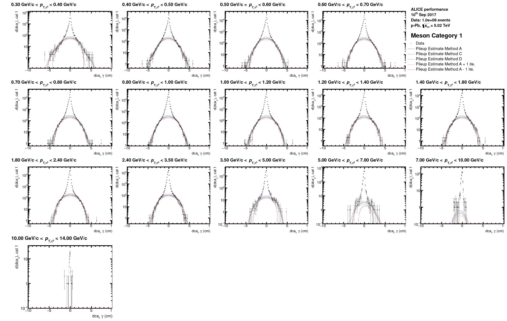
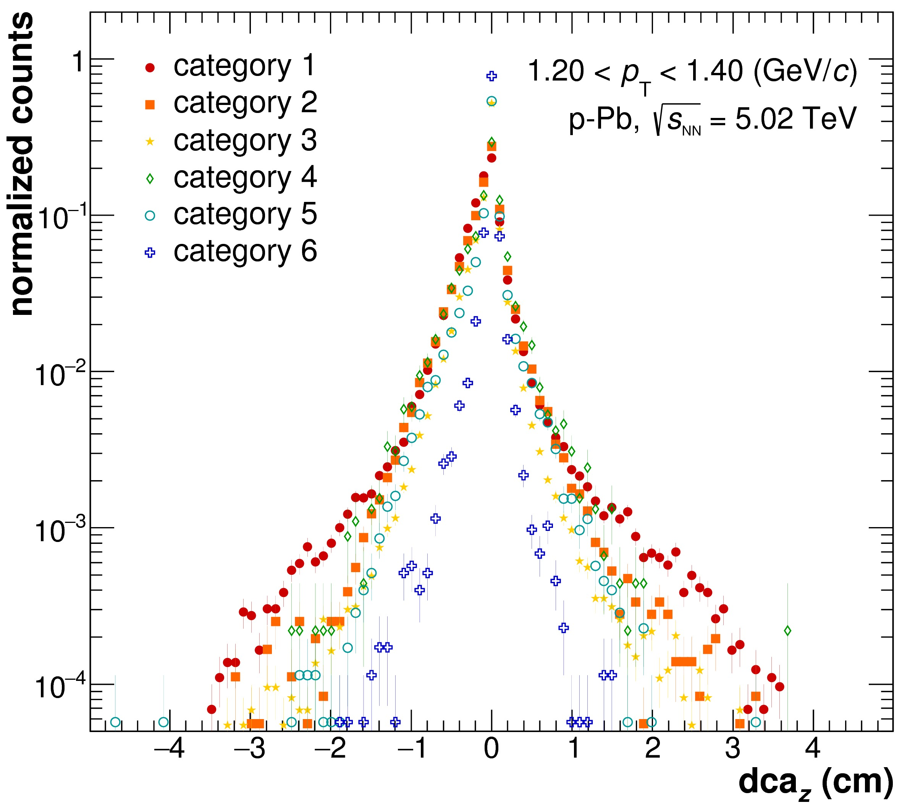

# Neutral Pion and Eta Analysis

Before you start the analysis, get input .root files from grid and change their format by using the macros provide in the folder **AnalysisSoftware/DownloadAndDataPrep/** or **AnalysisSoftware/TaskQA**, as describe in the QA section.\
The neutral pion and eta analysis in the $$\gamma\gamma$$ channel is based on the analysis tasks:

* AliAnalysisTaskGammaConvV1.cxx
* AliAnalysisTaskGammaCalo.cxx
* AliAnalysisTaskGammaConvCalo.cxx

Each of them produces its own output files, which have to be provide to the _start\_FullMesonAnalysis\_TaskV3.sh_. The script can be started as follows:

```
  start_FullMesonAnalysis_TaskV3.sh [-$OPTION] $Data-file.root [$MC-file.root] eps
```

If for some reason no data-file or MC-file is available you can give the script a dummy-file it will automatically detect this and try to avoid the corresponding macro running. It could however be that there are some errors in these cases and this option should only be used as a first trial not the general modus operandi. There are several specific options available to either jump to a specific step of the analysis (`-d,-c`) or switch on and off the gamma, pion or eta analysis (`etaOff,etaOnly,gammaOff,gammaOnly,pi0etaOnly,pi0Only`). The latter can be appended to he first two, but the option string has to start with a "-". If you want to jump to a more step further along the processing line you only have to hand it one root file and even that can be a dummy file if the _CutSelection.log_ file contains the desired and valid Cutnumbers. In these case make sure the output files from the previous steps are contained in the current directory, where you are working. Otherwise the operation will fail. As already described most of the macros started by this shell-script are contained in the folder [**AnalysisSoftware/TaskV1**](https://gitlab.cern.ch/alice-pcg/AnalysisSoftware/TaskV1) and the general strategy for running is displayed in

.jpg>)

It is recommended that you start the shell-script once per hand for each new analysis, which you do, as it will ask you questions, which you need to answer. These questions depend on the data set and collision system you have chosen, as well as the options you have given to the macro. For instance the questions asked for the pPb-direct photon analysis in the PCM-EMC analysis stream are (with the corresponding answers):

```
$ bash start_FullMesonAnalysis_TaskV3.sh -etaOff $referenceDirectoryData/GammaConvCalo_LHC13bc-pass2_20_A.root $referenceDirectoryMC/GammaConvCalo_MC_LHC13b2_efix_p1_p2_p3_p4_20_A.root eps 
-etaOff
/mnt/additionalStorage/OutputLegoTrains/pPb/Legotrain-vAN20170525FF-newDefaultPlusSys/GammaConvCalo_LHC13bc-pass2_20_A.root
/mnt/additionalStorage/OutputLegoTrains/pPb/Legotrain-vAN20170525FF-newDefaultPlusSys/GammaConvCalo_MC_LHC13b2_efix_p1_p2_p3_p4_20_A.root
eps
eta calculation switched off
The data file specified is /mnt/additionalStorage/OutputLegoTrains/pPb/Legotrain-vAN20170525FF-newDefaultPlusSys/GammaConvCalo_LHC13bc-pass2_20_A.root
The MC file specified is /mnt/additionalStorage/OutputLegoTrains/pPb/Legotrain-vAN20170525FF-newDefaultPlusSys/GammaConvCalo_MC_LHC13b2_efix_p1_p2_p3_p4_20_A.root
Which mode are you running? 0 (PCM-PCM), 1 (PCM-Dalitz), 2 (PCM-EMCAL), 3 (PCM-PHOS), 4 (EMCAL-EMCAL), 5 (PHOS-PHOS), 9 (old files), 10 (EMC-merged), 11 (PHOS-merged), 12 (DCal-DCal), 13 (PCM-DCal)
2
You are analysing PCM-EMCAL output
Do you want to take an already exitsting CutSelection.log-file. Yes/No
N
Which collision system do you want to process? 13TeV (pp@13TeV), 13TeVLowB (pp@13TeV), 8TeV (pp@8TeV), 7TeV (pp@7TeV), 900GeV (pp@900GeV), 2.76TeV (pp@2.76TeV), 5TeV (pp@5.02TeV),  PbPb_2.76TeV (PbPb@2.76TeV), PbPb_5.02TeV (PbPb@5.02TeV), XeXe_5.44TeV(XeXe@5.44TeV), pPb_5.023TeV (pPb@5.023TeV)
pPb5
The collision system has been selected to be pPb_5.023TeV.
Is a cocktail file available? Yes/No?
Y
Please enter the filepath of the cocktail file.
/home/fbock/Photon/Software/PCGGIT/CocktailGridRuns/EMCocktail_pPb5TeV_PCMEMC_defaultParam_20170901.root
The cocktail file specified is /home/fbock/Photon/Software/PCGGIT/CocktailGridRuns/EMCocktail_pPb5TeV_PCMEMC_defaultParam_20170901.root
Please enter the rapidity used in the cocktail, e.g. 0.80
0.80
Rapidity of 0.80 has been chosen.
Do you want to produce Direct Photon plots? Yes/No?
YPCMEMC
Will produce Direct Photon plots with special PCMEMC binning...
How many p_T bins do you want to use for Pi0/direct photon?  21 (8 GeV), 22 (10 GeV), 23 (14 GeV), PCM-EMC 33
28
You have chosen  28  pt bins for pi0 in direct photon binning
Do you want to use MinBias Efficiencies only? Yes/No?
Y
Calculating MinBias Efficiecy only ...
Do you want to use THnSparse for the background? Yes/No?
N
Will NOT use THnSparse for the background ...
mode has been chosen: 2 
I went into standard modes
Which fit do you want to do? CrystalBall or gaussian convoluted with an exponential function? CrystalBall/Gaussian?
G
Gaussian chosen ...
Please check that you really want to process all cuts, otherwise change the CutSelection.log. Remember at first all gamma cutstudies will be carried out. Make sure that the standard cut is the first in the file. Continue? Yes/No?
Y
```

After you have understood and verified that the answers you gave, have the desired outcome you can also store them in a text file ($ENTER-separated) like [answersExamplepPbPCMEMC.txt](https://github.com/friederikebock/pcgtutorial/tree/afa081321e76f57996136d234ccab32c7a24f6f2/assets/answersExamplepPbPCMEMC.txt) and start the script like this:

```
 bash start_FullMesonAnalysis_TaskV3.sh -etaOff $referenceDirectoryData/GammaConvCalo_LHC13bc-pass2_20_A.root $referenceDirectoryMC/GammaConvCalo_MC_LHC13b2_efix_p1_p2_p3_p4_20_A.root eps < answersExamplepPbPCMEMC.txt
```

This option makes it possible to run many different start scripts after one another started by a common shell script without needing to interact with it. In general it is recommended to have one additional bash script, where you keep track what you usually use as input files and which analysis you ran in a certain directory (i.e. [runBaseCuts.sh](https://github.com/friederikebock/pcgtutorial/tree/afa081321e76f57996136d234ccab32c7a24f6f2/assets/runBaseCuts.sh) ). This also helps to keep track of your files and reduces the probability of creating an error during the configuration of the shell script.

In the following we will go through the different basic macros started by the shell-script and show some characteristic plots produced by them. In general it is recommended to have a look at all plots, log-files and couts which are produced by the various macros in particular for new-commers, as these are there for a reason and should not be ignored. We strongly recommened, however, not to reinvent the wheel and simply use the macros and ask if there is an output which you are missing or which is not clear to you. This will help us improve the software and you to save time (not wasting your energy on redesigning the plotting routines, as the later are in most cases already pretty good and have been used for the publications of the PWGGA).\
If you find a bug in the software, please let us know as it might not only affect you but also others and as such can have quite a large impact. Remember to also take this into account if you make changes, we all benefit from a common framework but this means we all need to do our best to keep it running and improve it. **YOU ARE NOT JUST A USER, YOU ARE A DEVELOPER!** So please make sure your changes don't interfer with someone else working code. Everyone else will try to do the same for you!

A nice little 'helper-macro' is the [_MakeCutLog.C_](https://gitlab.cern.ch/alice-pcg/AnalysisSoftware/tree/master/TaskV1/MakeCutLog.C), which tells you which cuts are contained in the corresponding file. It can be started with:

```
root -b -x -q -l 'TaskV1/MakeCutLog.C("file.root","CutSelection.log",$mode)'
```

It will write a file called _CutSelection.log_, as defined by the argument. It is called by default when executing our base shell-script and call cuts contained in this cutselection file will be analyzed. If you don't want that, you explicitly have to tell this when asked about this particular file and edit it yourself.

The modes which are defined in the conversion software are:

| mode | reco technique |
| ---- | -------------- |
| 0    | PCM-PCM        |
| 1    | PCM-Dalitz     |
| 2    | PCM-EMC        |
| 3    | PCM-PHOS       |
| 4    | EMC-EMC        |
| 5    | PHOS-PHOS      |
| 6    | EMC-Dalitz     |
| 7    | PHOS-Dalitz    |
| 10   | mEMC           |
| 11   | mPHOS          |
| 12   | DMC-DMC        |
| 13   | PCM-DMC        |

## Neutral Pion and Eta Meson Signal Extraction

### [_**ExtractSignalV2.C**_](https://gitlab.cern.ch/alice-pcg/AnalysisSoftware/tree/master/TaskV1/ExtractSignalV2.C)

This macro is supposed to:

* analyse the invariant mass of the mesons for each pT bin
* subtract the mixed event BG after proper normalization,
* fit the peak with different peak functions and
* extract the raw yields

in case a data file is processed. If it is a MC file it does all this and extracts the correction factors (acceptance, efficiency, secondary contamination,...) in addition. Furthermore, different estimates of the additional BG subtraction are computed and the signal is extracted in different integration windows around the fitted meson peak to later determine the signal extraction uncertainty.\
The $$p_T$$-binning for the $$\pi^0/\eta$$ is defined in the header [_ExtractSignalBinning.h_](https://gitlab.cern.ch/alice-pcg/AnalysisSoftware/tree/master/CommonHeaders/ExtractSignalBinning.h). The macro can be started on a standalone basis as follows:

```
root -b -x- q -l 'TaskV1/ExtractSignalV2.C+("$MESONAME","#ROOT-File","$CUTNUMBER","$SUFFIX","$MCOPTION","$ENERGY","Gaussian","$OPTIONSA","$OPTIONSB","","",$NPTBINS,$OPTIONADDSIG,$MODE,0,$OPTIONTHNSPARSE)'
```

for the data set above the data and MC would have been called as follows:

```
root -b -x- q -l 'TaskV1/ExtractSignalV2.C+("Pi0","/mnt/additionalStorage/OutputLegoTrains/pPb/Legotrain-vAN20170525FF-newDefaultPlusSys/GammaConvCalo_LHC13bc-pass2_20_A.root","80000113_00200009327000008250400000_1111141057032230000_0163103100000010","eps","kFALSE","pPb_5.023TeV","Gaussian","directPhotonA","MinBiasEffOnly","","",28,kFALSE,2,0)'
root -b -x- q -l 'TaskV1/ExtractSignalV2.C+("Pi0","/mnt/additionalStorage/OutputLegoTrains/pPb/Legotrain-vAN20170525FF-newDefaultPlusSys/GammaConvCalo_MC_LHC13b2_efix_p1_p2_p3_p4_20_A.root","80000113_00200009327000008250400000_1111141057032230000_0163103100000010","eps","kTRUE","pPb_5.023TeV","Gaussian","directPhotonA","MinBiasEffOnly","","",28,kFALSE,2,0)'
```

For the details on the options you can have a look at the code. For beginners, it is however highly recommended to start it once with the shell-script to obtain the proper options. The macro will write its plots to **$CUTNUMBER/$ENERGY/$SUFFIX/ExtractSignal** and the corresponding subfolders. The most important output will look like the following plots and all of them should be studied in detail for all cuts and mesons. Also some trending plots are stored in the the corresponding subfolder. These will allow you to judge whether the parameter-settings were reasonable and the fits didn't run into any particular limits.

\
\
\
\


In addition it writes its log-files as well as the root-files to **$CUTNUMBER/$ENERGY/** they are called:

```
$MESONNAME_[data,MC]_EffiCheck_RAWDATA_$CUTNUMBER.dat
$MESONNAME_[data,MC]_FileErrLog_80000113_$CUTNUMBER.dat
$MESONNAME_[data,MC]_GammaConvV1WithoutCorrection_$CUTNUMBER.root
$MESONNAME_[data,MC]_GammaExtractionEffiCheck_RAWDATA_$CUTNUMBER.dat
$MESONNAME_MC_GammaConvV1CorrectionHistos_$CUTNUMBER.root
```

**!!! Very important: !!!**

Check the $CUTNUMBERS/$ENERGY/$SUFFIX/EXTRACTSIGNAL/MONITORING folder to see if the mass peaks are fitted with high quality fits meaning:

* MESON Amplitude converged well for each bin
* MESON LambdaTail converged within its limits (this parameter can be fixed for higher pt if it is needed)
* MESON Sigma converged also within its limits and has a smooth behaviour as function of pt
* MESON Mass converged within limits and has a smooth behaviour as function of pt

Also check all the plots in $CUTNUMBERS/$ENERGY/$SUFFIX/EXTRACTSIGNAL/ to check if all the bins have sufficient statistics for both data and MC. Increase the pt bin widths if there is a lack statistics. The number of bins in the invariant mass plots can also be adjusted, make sure there are sufficients points to be fitted in the main signal peak.

### [_**AnalyseDCADist.C**_](https://gitlab.cern.ch/alice-pcg/AnalysisSoftware/tree/master/TaskV1/AnalyseDCADist.C)

This macro is especially need for the PCM $$\pi^0$$ and $$\eta$$ analyses. In case of the PCM photons the association to the event is not as easy as for the EMCal photons as there is no direct variable which relates a certain PCM photon in terms of time to corresponding event. Especially photons which are reconstructed only based on the TPC tracks can orginate with a certain probabiltity from one of the neighboring bunch crossings. As a rule of thumb one can say that a TPC track coming from a collision 500ns after the triggering one will be displaced by about 1.5 cm in Z in the TPC compared to the ones from the triggering collisions. This is due to the drift time of the electrons of 2.7 cm/$$\mu$$s and the total drift length of about 92 $$\mu$$s. The latter is approximately as long as 1 bunch needs to go round the LHC once. This mean that many tracks from neighboring bunches are actually contained in the TPC and as such also many photons. These tracks can only be rejected as pileup if they are not pointing to the primary vertex within a certain window, which needs to be larger for secondary tracks compared to primary tracks and depends on the primary vertex resoluton for the TPC-only tracks.\
To evaluate the contribution from these out-of-bunch photons to the neutral meson spectra the _AnalyseDCADist.C_-macro has been developed. Here we use the fact that a photon from another bunch-crossing will most likely have a different distribution in the distance of closest approach from the vertex in its Z-coordinate ($$dca_Z$$). This contribution will depend on the photon quality (1: TPC only photon, 2: 1 leg rec with TPC only, 3: both legs based on partial ITS+TPC information) which enters for the neutral meson reconstruction. As such 6 different categories have to be considered for the $$\pi^0 \& \eta$$ analysis. Within this macro the projections out of the dca-trees contained in the GammaConvV1\_\*.root for the $dca\_Z$ of photon candidates in the invariant mass region of the corresponding meson are filled for the different reconstruction qualities and then evaluated using a root internal 'background finding' routine (`TH1::ShowBackground()`).\
The macro can be executed as follows:

```
    root -b -x -q -l 'TaskV1/AnalyseDCADist.C+("$MESON","Data-main-file.root","Data-add-file.root","$CUTNUMBER","eps","$ENERGY","",kFALSE,$NPTBINS,0)
```

It has to be run by hand as it most likely will need special adjustments for every energy and maybe even data-taking period. However, it is not necessary to run it for every possible cutvariaion when calculating the systematic uncertainties due to other sources. In this case you can simply copy the output-file of the standard cut ($CUTNUMBER/$ENERGY/$MESON/home/$MESON\_Data\_GammaConvV1DCATestAnalysed.root) into the directories of the variations ($CUTNUMBERs/$ENERGY/).\
It has to be carefully checked that the 'wings' in all $$p_T$$ bins at higher $$|dca_Z|$$ or neither underestimated nor overestimated which might need some tweaking of the following parameters in [CommonHeaders/ExtractSignalBinning.h](https://gitlab.cern.ch/alice-pcg/AnalysisSoftware/tree/master/CommonHeaders/ExtractSignalBinning.h):

```
    fMaxYFracBGOverIntHist              = 50;
    nIterBGFit                          = 13;
    TString optionBGSmoothingStandard   = "BackSmoothing9";
    TString optionBGSmoothingVar1       = "BackSmoothing7";
    TString optionBGSmoothingVar2       = "BackSmoothing11";
```

Examples of optimized fits and the corresponding final correction factors can be found in the following plots or in the latest PCM analysis notes on pp 8Tev, pPb 5TeV or Pb-Pb 2.76TeV.

*   worst DCA meson category (2\* category 3 photons)

    
*   best DCA meson categories (at least 1 photon with ITS info)

    
*   all categories overlayed

    
*   $$dca_Z$$ distribution in different invariant mass windows

    
*   Calculated out-of-bunch pileup contribution for different categories separately

    
*   correctly weighted out-of-bunch pielup contribution using different estimates

    

## Meson Corrections

### [_**CorrectSignalV2.C**_](https://gitlab.cern.ch/alice-pcg/AnalysisSoftware/tree/master/TaskV1/CorrectSignalV2.C)

Applies the corrections to the raw yields; the input for this macro is the output from the _ExtractSignalV2.C_ and _AnalyseDCATestV1.C_. Also in this a .root file and plots are produced in the folder of the respective cutnumber.

The arguments of the function are

```
void  CorrectSignalV2(  TString fileNameUnCorrectedFile = "myOutput",
                        TString fileNameCorrectionFile  = "",
                        TString fCutSelection           = "",
                        TString suffix                  = "gif",
                        TString nameMeson               = "",
                        TString isMC                    = "",
                        TString optionEnergy            = "",
                        TString optionPeriod            = "",
                        TString fEstimatePileup         = "",
                        Bool_t optDalitz                = kFALSE,
                        Int_t mode                      = 9,
                        Int_t triggerSet                = -1

                     ){
```

The main script executes CorrectSignalV2.C automatically but it can be called independently with:

```
root -b -x- q -l 'TaskV1/CorrectSignalV2.C+("$FILETOCORRECT","$FILEWITHCORRECTIONS","$CUTNUMBER","$SUFFIX","$MESON","$ISMC","$ENERGY","","",$DALITZ,$MODE)'
```

As an example:

```
root -b -x- q -l 'TaskV1/CorrectSignalV2.C+("80000113_11111410570a2230000_01631031000000d0/pPb_5.023TeV/Pi0_data_GammaConvV1WithoutCorrection_80000113_11111410570a2230000_01631031000000d0.root","80000113_11111410570a2230000_01631031000000d0/pPb_5.023TeV/Pi0_MC_GammaConvV1CorrectionHistos_80000113_11111410570a2230000_01631031000000d0.root","80000113_11111410570a2230000_01631031000000d0","eps","Pi0","kFALSE","pPb_5.023TeV","","",kFALSE,4)'
```

Important output plots are (non exhaustive list):

* $MESON\_Acceptance
* $MESON\_TrueEffSimple
* $MESON\_Mass
* $MESON\_RatioMass
* $MESON\_FWHM
* $MESON\_RatioFWHM
* $MESON\_Data\_RawYieldDiffIntRanges
* $MESON\_Data\_CorrectedYield (Normal or True efficiency, always use True for PCM analyses and Normal for Calorimetric)

Questions to ask yourself while inspecting the histograms:

* Is the acceptance behaving like you expect
* Is the efficiency bahaving like it should; and is the difference between the Reconstructed and True efficiency reasonable?
* Is the reconstructed pi0 mass in data and MC close? Judge this also from the ratio plot. 1% offset means roughly 4% error in the corrected yield!!
* Is the FWHM simulated well in MC and does it behave as expected?
* Is the RawYield with different integration ranges stable?
* The corrected yield is only to be checked as last plot, it has no value unless everything else is of high quality!

### Secondary Corrections for the neutral pion reconstruction

#### How To obtain the necessary Input Spectra & Cocktail Output

For the secondary correction to the $$\pi^0$$'s and $\gamma$'s we do not rely any longer purely on the simulations, except for the material interactions contribution, consequently additional experimental inputs are needed. For each collision system the measured spectra for $$K^0_s$$ & $$\Lambda$$ will be needed (ask LF convenors for corresponding input if not already included in the [cocktail framework](https://gitlab.cern.ch/alice-cocktail-EM/cocktail\_input) ). If these are not available in a certain collision system, energy or centrality one can either use the charged kaons as proxy for the $$K^0_s$$ or in the pp case inter/-extrapolate the kaons/Lambda's from other collision energies. For the later ideally all available collision energies are to be used (i.e 0.9, 2.76, 7, 13 TeV to get to 5 or 8 TeV). For the Lambda no other obvious candidate exists which could stand in as proxy for the Lambda if inter-/extrapolation is not possible. In that case one can use $$m_T$$ scaling from the proton, this is however much less precise.\
For the description of the interpolation procedure you can jump to the [Cocktail Framework Intro](https://friederikebock.gitbooks.io/pcgtutorial/content/Afterburners/Cocktail/cocktail.html). If $$m_T$$ scaling is used there is no need to do calculate the spectrum separately it would be automatically if the $$\Lambda$$ is enabled in the cocktail parametrization in cocktail-framework. A detailed description how the corresponding spectra need to be included in the cocktail frame work and how they are paremetrized is given in the section [Cocktail Framework Intro](https://friederikebock.gitbooks.io/pcgtutorial/content/Afterburners/Cocktail/cocktail.html) along with the instructions on how to run the corresponding cocktail on the grid. However, you have to ensure the train-operator enables the wagon for the hadronic cocktail as well (Pi0Cocktail\_diffRap), which will run several wagons of AliAnalysisTaskHadronicCocktailMC.cxx in parallel on the output of the generated EM-cocktail.\
A general remark: Make sure your parametrization for all particles describe the spectra better than 5-10% over the full measured transverse momentum region, as otherwise the generated cocktail will certainly not reproduce the data. At low include (0,0) in the fitting and at high make sure the n of all spectra is approximately the same and they don't cross in the unmeasured region if they are not expected to.

#### Integration of the Cocktail-output in the Analysis-Flow for the Pi0's

* Once the train finished or you generated the file on your computer, copy the _AnalysisResults.root_ file to your computer and rename it ideally with the data of generation, system and settings short hand for bookeeping.
* When asked by the _start\_FullMesonAnalysis\_TaskV2.sh_ whether you have a cocktail file answer "Yes" and answer the consecutive questions regarding the file location and rapidity settings. For the later the answer is "0.8" for most analysis and it depends on the rapidity range you are using in the corresponding cutselection and analysis.
* This should take care of nearly everything else necessary afterwards. However you have to control whether the secondary efficiency and acceptance make sense as these might need to be fixed due to lack of statistics in the corresponding MC. Have a look at the corresponding plots for that. Examples for the pion reco are shown below.

Pi0\_AcceptanceWithSec\_\* & Pi0\_RatioSecEffiToTrueEff\_\*

\
\
Pi0\_TrueEffWithSecEffi\_\*\


Pi0\_data\_EffectiveSecCorrPt\_\* & Pi0\_data\_RAWYieldSecPt\_\*

,\
,

* Make sure the appropriate functions are used if you need to fix the secondary correction factors, these might depend on energy, collision system and reconstruction method, please try to adjust it such that you don't interfere with existing exceptions.
* Repeat the cocktail generation procedure, if the parametrizations are not good enough.

## **MC** $$p_T$$ **weighting**

### **Goal**:

Adjust the pT distribution of MC particles (pi0s and/or eta mesons) to the shape of their distribution in data

### **Prerequisite**:

Fully corrected yields (using efficiency correction from unweighted MC. If you have a MC with added signals, reject them for now)

### **Description of relevant functions and macros:**

The macros [_**ExtractInputForWeights.C**_](https://gitlab.cern.ch/alice-pcg/AnalysisSoftware/tree/master/SupportingMacros/ExtractInputForWeights.C) and [_**ExtractInputForWeightsPbPb.C**_](https://gitlab.cern.ch/alice-pcg/AnalysisSoftware/tree/master/SupportingMacros/ExtractInputForWeightsPbPb.C) are used for preparing the weighting.

* They fit the pT spectra from data and save them in a root file e.g. _MCSpectraInputPbPb.root_
* They normalize pT spectra from MC like invariant yields and save them in the same root file. You may need to save one histogram for each MC production, (as the shapes of the spectra might be different), and separate histograms for the distributions of regular and added particles (as the latter are produced flat in pT on purpose to enhance the statistics at high pT). If you analyze different centrality classes, you need all fits and histograms for every cent class separately of course.
* They produce plots to validate the quality of the fits and to see how much the MC distributions actually deviate from data

In _AddTask\_GammaConvV1\_PbPb.C_

* the weighting is activated with the flag _doWeighting_
* the name of the file, from which histos and fits should be loaded, is specified in the variable _fileNameInputForWeighting_ (e.g. as _MCSpectraInputPbPb.root_)
* the names of the histograms and fits within _MCSpectraInputPbPb.root_ are specified, depending on _periodNameAnchor_ and _periodName_
* _weightPi0_ and _weightEta_ are set to kTRUE to activate the weighting for the respective meson
* these settings are handed over to the current instance of the class AliConvEventCuts and the histograms are loaded with the function AliConvEventCuts::LoadReweightingHistosMCFromFile()

In _AliAnalysisTaskGammaConvV1.cxx_

* Before filling MC meson $$p_T$$ histograms, e.g. in AliAnalysisTaskGammaConvV1::ProcessMCParticles(), the weight at the $$p_T$$ value of the current meson is calculated by calling _AliConvEventCuts::GetWeightForMeson()_

The acutal calculation of weights is done in _AliConvEventCuts::GetWeightForMeson()_

* the ratio data/MC at a given pT, evaluated/interpolated from the fit-functions/histograms from _MCSpectraInputPbPb.root_ is caluclated
* It distinguishes between MCs with added particles (kCaseGen=1) and normal MCs (kCaseGen=2) because IsParticleFromBGEvent has to be called for added particles but must not be called for normal MCs. kCaseGen=3 is used for direct photons

### **Neccessary code modifications** to AliPhysics for a new period/MC:

* add the names of the MCs you want to weight to the function _AliConvEventCuts::GetWeightForMeson()_
* In the _AddTask_ define the names of the histograms and fits if necessary

### **Analysis steps**:

1. Produce corrected yields, efficiency-corrected using the un-weighted MC(s) without added particles
2. Fit the data, check the quality of the fit, check the agreement between MC and data
3. Produce the root file with the required histograms and fits. Upload it to aliensh and specify the path and filename in your analysis wagon
4. Run the train(s)
5. When you have your weighted output, use it to recalculate the efficiency. You can also use the added particles now. Use this efficiency to recalculate corrected yields. Compare the new corrected yields to the ones before weighting.
6. Redo step 2. If the new fit agrees with the data and the weighted Monte Carlo input within the statistical errors the procedure was successful, if this is not the case another iteration is necessary. In the latter case, repeat steps 3., 4., 5. and 6.

#### **How to calculate the combined efficiency from added particles and normal MC:**

* You have to give the train output file to _start\_FullMesonAnalysis\_TaskV3.sh_ in addition to the data and the regular MC file.
* To be able to do so, you have to use one of the existing options -mAddSig... or define a new one
* Here you also make the settings MERGINGMC=1 (so that ExtractSignal is being run for an additional MC file) and ADDEDSIG=1 so that the macro _MergeEffiWithProperWeighting2760GeV.C_ is called.
* The macro _MergeEffiWithProperWeighting2760GeV.C_ calculates a weighted efficiency, depending on the statistical errors, using the formula below. It produces plots to compare the efficiencies. There you can also check at which p\_T the added particle MC efficiency becomes more precise than the efficiency from regular MC. The resulting effiency is automatically saved in the correct file to be used by \_CorrectSignalV2.C\_ to produce corrected yields.


#### **How to upload a file to aliensh**

```
alien_cp file:filename.root alien:path/filename.root
```

## Preparing for the systematics running

### [_**CutStudiesOverview.C**_](https://gitlab.cern.ch/alice-pcg/AnalysisSoftware/tree/master/TaskV1/CutStudiesOverviev.C)

* gives systematic uncertainty on cut variation with different sets of cuts.
* input: CutSelection.log + uncorected file, corrected file

## Compilation of the final results for each collision system, energy and detector

_ProduceFinalResultsV2.C_

* gives corrected yield of each mesons with systematic uncertainties.
