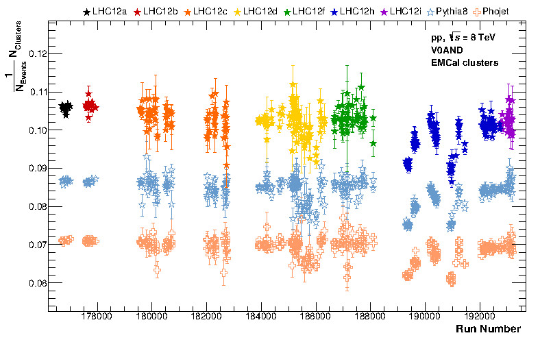
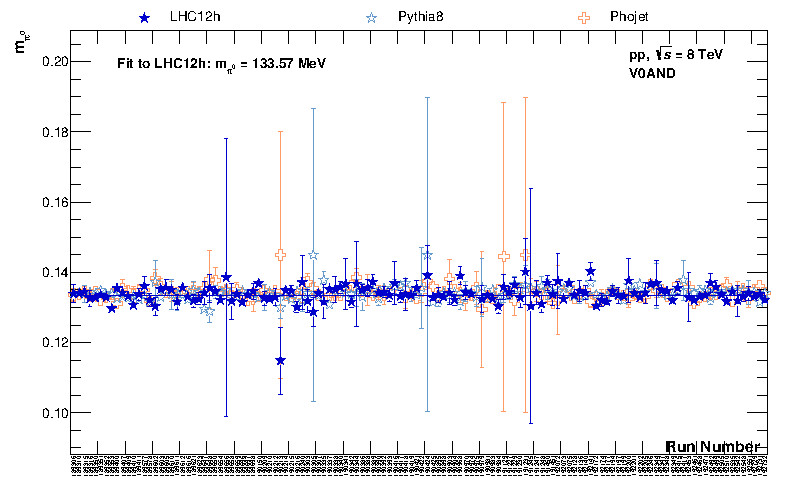

# EventQA

**This part of the QA must be run for any analysis as it checks basic event properties.**

The event QA covers general event properties as well as global variables like:

**generated histograms \(list of examples\)** \(full set of generated histograms can be deduced from the macros themselves/or from the output generated\): 1. Cut overview histograms \(vs. $$p_T$$\) 2. Number of events, number of tracks in TPC,... 3. Fraction of MinBias events, fraction of good events, fraction of pileup events... 4. Z-vertex distributions and its mean+sigma values for each run 5. Number of Photon Candidates per event: PCM, Calo 6. Neutral meson related quantities: avg. number of meson candidates per event, mean/sigma of transverse momentum, Y, alpha, opening angle of decay gammas\(in case of 2 gamma analysis\)...

Running the EventQA\(\_Runwise\).C will save the output into the following folder structure:

> _CUTNUMBER/SYSTEM/EventQA/_

In addition, \*.root files will be generated in _CUTNUMBER/SYSTEM/_ containing all the histograms as well.

Carefully check all output from runwise/full output with special focus on data/MC comparison \(Is the MC able to reproduce all QA histograms extracted from data? Does the MC follow the trends seen in data? Are there any suspicious runs or any observations that cannot be explained?...\) In general, they should be stable vs. run number - however, one of the exceptions is pileup which may vary from run to run -&gt; need to be taken with special care!

Some example plots for 1.-6.:

1. 
2. 
3. 
4. 
5. 
6. 

